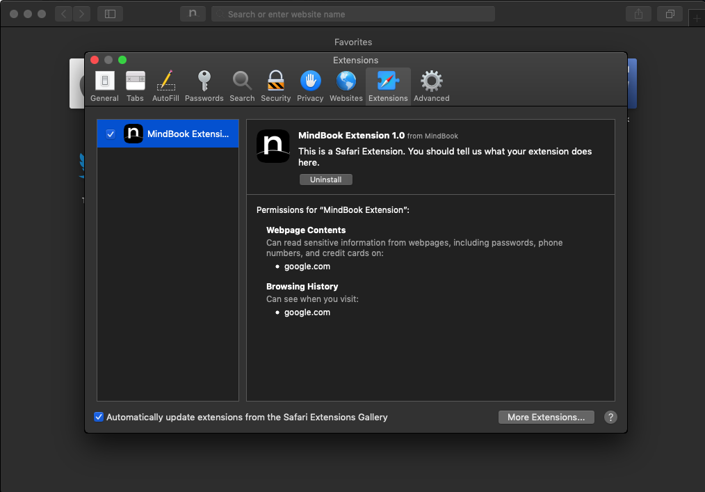

# MindBook Safari App Extension

## Install App

### Environment

This app extension requires macOS 10.11 (OS X El Capitan) or later.

### Download & Run

1. Download the `.app` file from "the Trello card".
1. Right-click (or <kbd>control</kbd>-click) the application in question and choose “Open”.
1. Click the “Open” button at the next dialog warning to launch the app anyway.

You can do this with any third party app that gives you this warning dialog and open it anyway.

### Enable Safari Extension

1. Open Safari and choose Safari > Preferences.
1. Select the Advanced tab, then select the “Show Develop menu in menu bar” checkbox.
1. Choose Develop > Allow Unsigned Extensions. The Allow Unsigned Extensions setting is reset when a user quits Safari; **you must set it again the next time Safari is launched**.
1. Select the Extensions tab. This tab shows the localized description, display name, and version number for the selected Safari App Extension. It also provides a more nuanced message about the permissions claimed by the extension.
1. Find your new extension in the list on the left, and enable it by selecting the checkbox.

Your new extension is now enabled. You’ll see a new toolbar item (a button) in the Safari toolbar.

## Development

### Environment

1. macOS 10.11 or later
1. Xcode 8 or later
1. Swift 5 or later

### Setup

1. Clone this project
1. Go to `mindbook/safari-app-extension/`
1. Open `MindBook.xcodeproj` with Xcode

### Debug

1. Press <kbd>shift</kbd> + <kbd>⌘ Command</kbd> + <kbd>K</kbd> to clean build folder.
1. Press <kbd>⌘ Command</kbd> + <kbd>R</kbd> to run the debugging app with extension.
